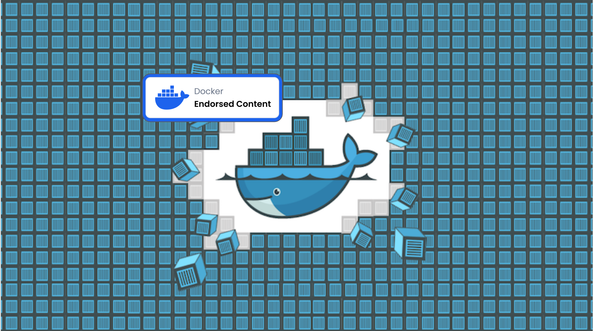

# [Docker-Endorsed] Docker - Introducing Docker Essentials, Containers, and more

This Course has been endorsed by Docker in partnership with the Udemy Instructor Partner Program.

"Docker - Introducing Docker Essentials, Containers, and more": Official guide repo used to accompany video lessons.

Docker is an open platform that lets you package, develop, run, and ship
appications in environments called containers.

In this course:
- Run your own containers on the command line with Docker.
- Build your own container images with Dockerfiles.
- Persist data across containers with mounts.
- Compose multicontainer applications with Docker Compose.
- Update containers dynamically with volumes.
- Create private networks for Docker containers.
- Create a multinode cluster with Docker Swarm.
- Set up the automatic building of Docker Images with Docker Cloud.
- Configure automatic tests and a continuous integration workflow with Docker Cloud.

Check out the original course: 
https://www.udemy.com/docker-containers

